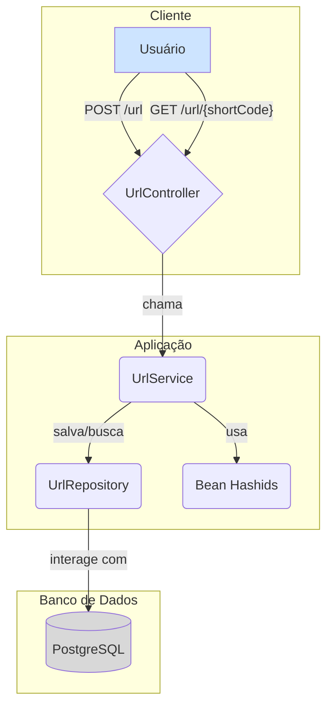

# Encurtador de URL

Este é um projeto de um encurtador de URL desenvolvido em Java com Spring Boot. Ele permite que você transforme URLs longas em URLs curtas e fáceis de compartilhar.

##  Tecnologias Utilizadas

*   **Java 17**
*   **Spring Boot**
    *   Spring Web
    *   Spring Data JPA
*   **PostgreSQL** (Banco de Dados)
*   **Hashids** (Para gerar os códigos curtos)
*   **Maven** (Gerenciador de Dependências)
*   **Docker** (Para o ambiente de desenvolvimento)

## Como Funciona

O processo de encurtamento de URL é projetado para ser eficiente e evitar colisões.

1.  **Recebimento da URL:** A API recebe a URL longa que o usuário deseja encurtar.
2.  **Verificação no Banco de Dados:** O sistema verifica se a URL longa já existe no banco de dados para evitar duplicatas.
3.  **Geração de ID com Sequence:** Se for uma nova URL, o sistema busca o próximo ID de uma sequência customizada no banco de dados chamada `url_short_seq`. Isso garante um número único antes mesmo de salvar a entidade.
4.  **Codificação do ID:** O ID numérico é então codificado usando a biblioteca **Hashids**, com um tamanho mínimo de 5 caracteres. Isso transforma um número como `1` em uma string curta e não sequencial como `jRk4n`. Essa string é a nossa URL curta.
5.  **Salvamento e Redirecionamento:** A URL original, o ID e as datas de criação/expiração são salvos no banco. Quando um usuário acessa a URL curta, o sistema decodifica a string para obter o ID original, busca a URL longa correspondente e redireciona o usuário.

### Diagrama do Fluxo



## Como Executar o Projeto

Para executar o projeto, siga estes passos. É crucial seguir a ordem para garantir que o banco de dados e a aplicação sejam inicializados corretamente.

1.  **Clone o repositório:**
    ```bash
    git clone <url-do-seu-repositorio>
    cd encurtadorUrl
    ```

2.  **Inicie o banco de dados com Docker Compose:**
    Este comando irá criar e iniciar um container PostgreSQL com as configurações definidas no `docker-compose.yaml`.
    ```bash
    docker-compose up -d
    ```

3.  **Crie a Sequência no Banco de Dados:**
    Antes de iniciar a aplicação, você **precisa** criar a sequência que gera os IDs para as URLs. Conecte-se ao banco de dados (usando uma ferramenta como DBeaver, pgAdmin ou o próprio terminal) e execute o seguinte comando SQL:
    ```sql
    CREATE SEQUENCE url_short_seq START WITH 1 INCREMENT BY 1;
    ```

4.  **Configure o `application.properties`:**
    Renomeie ou copie o arquivo `src/main/resources/application_copy.properties` para `src/main/resources/application.properties`. Em seguida, preencha com as seguintes informações:
    ```properties
    spring.datasource.url=jdbc:postgresql://localhost:5432/encurtador_url
    spring.datasource.username=postgres
    spring.datasource.password=postgres
    spring.jpa.hibernate.ddl-auto=update

    # Segredo para o Hashids (use um valor forte e único)
    hashids.secret=seu-segredo-super-secreto
    ```

5.  **Execute a aplicação com Maven:**
    ```bash
    ./mvnw spring-boot:run
    ```

A aplicação estará disponível em `http://localhost:8080`.

## Endpoints da API

*   `POST /url`
    *   **Descrição:** Encurta uma nova URL.
    *   **Body (JSON):**
        ```json
        {
          "url": "https://sua-url-longa-aqui.com/"
        }
        ```
    *   **Resposta de Sucesso (201 Created):**
        ```json
        {
            "urlShort": "http://localhost:8080/url/jRk4n",
        }
        ```

*   `GET /url/{shortenerUrl}`
    *   **Descrição:** Redireciona para a URL original.
    *   **Exemplo:** `http://localhost:8080/url/jRk4n`

## Considerações Importantes

*   **URL Base Fixa:** A URL base retornada na `urlEncurtada` está fixada no código como `http://localhost:8080/url/`. Para usar em um ambiente de produção, você precisará alterar isso no arquivo `UrlService.java`.
*   **Expiração de URL:** Por padrão, todas as URLs encurtadas expiram em **10 dias** após a sua criação.
