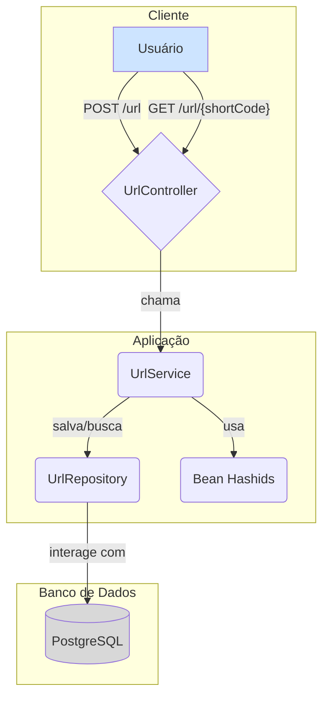

# Encurtador de URL

Este é um projeto de um encurtador de URL desenvolvido em Java com Spring Boot. Ele permite que você transforme URLs longas em URLs curtas e fáceis de compartilhar.

## Tecnologias Utilizadas

*   **Java 17**
*   **Spring Boot**
    *   Spring Web
    *   Spring Data JPA
*   **PostgreSQL** (Banco de Dados)
*   **Hashids** (Para gerar os códigos curtos)
*   **Maven** (Gerenciador de Dependências)
*   **Docker** (Para o ambiente de desenvolvimento)

## Como Funciona

O processo de encurtamento de URL é projetado para ser eficiente e evitar colisões.

1.  **Recebimento da URL:** A API recebe a URL longa que o usuário deseja encurtar.
2.  **Verificação no Banco de Dados:** O sistema verifica se a URL longa já existe no banco de dados para evitar duplicatas.
3.  **Salvamento e Geração de ID:** Se for uma nova URL, ela é salva no banco de dados. O banco de dados gera um ID numérico único (auto-incremento) para esse novo registro.
4.  **Codificação do ID:** O ID numérico é então codificado usando a biblioteca **Hashids**. Isso transforma um número como `123` em uma string curta e não sequencial como `BvL`. Essa string é a nossa URL curta.
5.  **Redirecionamento:** Quando um usuário acessa a URL curta, o sistema decodifica a string para obter o ID original, busca a URL longa correspondente no banco de dados e redireciona o usuário para o destino final.

### Diagrama do Fluxo



## Como Executar o Projeto

1.  **Clone o repositório:**
    ```bash
    git clone <url-do-seu-repositorio>
    cd encurtadorUrl
    ```

2.  **Inicie o banco de dados com Docker Compose:**
    ```bash
    docker-compose up -d
    ```

3.  **Configure o `application.properties`:**
    Crie um arquivo `src/main/resources/application.properties` com as seguintes informações:
    ```properties
    spring.datasource.url=jdbc:postgresql://localhost:5432/postgres
    spring.datasource.username=admin
    spring.datasource.password=123456
    spring.jpa.hibernate.ddl-auto=update

    # Segredo para o Hashids
    hashids.secret=seu-segredo-super-secreto
    ```

4.  **Execute a aplicação com Maven:**
    ```bash
    ./mvnw spring-boot:run
    ```

A aplicação estará disponível em `http://localhost:8080`.

## Endpoints da API

*   `POST /url`
    *   **Descrição:** Encurta uma nova URL.
    *   **Body (JSON):**
        ```json
        {
          "url": "https://sua-url-longa-aqui.com"
        }
        ```
    *   **Resposta de Sucesso (201 Created):**
        ```json
        {
            "id": 1,
            "urlOriginal": "https://sua-url-longa-aqui.com",
            "urlEncurtada": "http://localhost:8080/url/BvL",
            "dataCriacao": "2025-11-17",
            "dataExpiracao": "2025-11-27"
        }
        ```

*   `GET /url/{shortenerUrl}`
    *   **Descrição:** Redireciona para a URL original.
    *   **Exemplo:** `http://localhost:8080/url/BvL`

## Observação Importante

Existe um bug conhecido no arquivo `AppConfig.java`. A anotação `@Value("hashids.secret")` está incorreta e deveria ser `@Value("${hashids.secret}")`. Sem essa correção, o "sal" para o algoritmo Hashids será a string literal "hashids.secret" em vez do valor configurado no `application.properties`.
